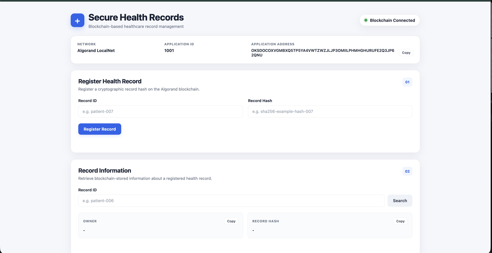
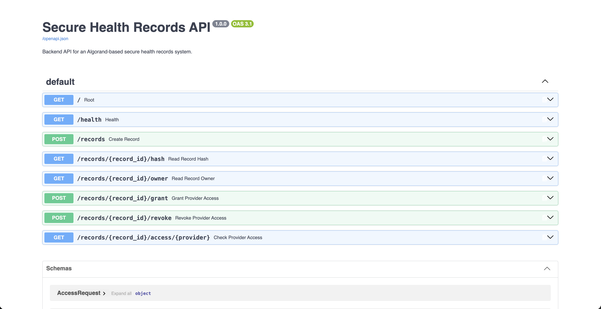

# Secure Health Records Using Algorand

A blockchain-based secure health record management system using the Algorand blockchain.

## Overview

This project implements a secure health record management system using Algorand smart contracts for record ownership, cryptographic hash storage, and patient-controlled healthcare provider access.

The system follows a patient-controlled authorization model in which patients can grant or revoke access to healthcare providers.

Actual healthcare records are kept off-chain. The blockchain stores record ownership, cryptographic hashes, and provider authorization information.

---

## Objectives

- Develop a secure healthcare record management system.
- Use Algorand blockchain for access-control management.
- Maintain healthcare record integrity using cryptographic hashes.
- Allow patients to grant and revoke provider access.
- Maintain transparent authorization records on the blockchain.
- Demonstrate blockchain-based healthcare access control.
- Keep sensitive healthcare data off-chain.

---

## System Architecture

The system consists of the following major components:

1. Patient
2. Healthcare Provider
3. Web Frontend
4. FastAPI Backend
5. Algorand Smart Contract
6. Algorand LocalNet
7. Off-chain encrypted record storage

### Architecture Flow

```text
Patient / Healthcare Provider
             |
             v
     HTML + CSS + JavaScript
             |
             | HTTP / REST
             v
        FastAPI Backend
             |
             v
    Algorand Typed Client
             |
             v
   HealthRecordsContract
             |
             v
      Algorand LocalNet
             |
             v
       Box Storage
```

Sensitive healthcare records are not stored directly on the blockchain.

Instead:

```text
Healthcare Record
       |
       v
Encrypted Off-chain Storage
       |
       v
Cryptographic Hash
       |
       v
Algorand Blockchain
```

---

## Key Features

### Patient

- Register healthcare records
- Store record hashes on the blockchain
- View record ownership
- Grant provider access
- Revoke provider access
- Check provider authorization

### Healthcare Provider

- Use an Algorand address as the provider identifier
- Check whether access has been granted
- Verify authorization status through the application

### Blockchain

- Record ownership management
- Cryptographic hash storage
- Provider access control
- Grant and revoke operations
- Tamper-evident blockchain state

---

## Smart Contract

The smart contract is implemented using Algorand Python / PuyaPy.

### Contract

```text
HealthRecordsContract
```

### Smart Contract Methods

```text
register_record()
grant_access()
revoke_access()
has_access()
get_record_hash()
get_record_owner()
```

### Record Owner

Each registered record stores its owner:

```text
owner_<record_id>
        |
        v
Patient Algorand Address
```

Only the record owner can grant or revoke provider access.

### Record Hash

The cryptographic hash is stored using:

```text
hash_<record_id>
        |
        v
Record Hash
```

### Provider Access

Provider permissions are stored using:

```text
access_<record_id><provider_address>
                    |
                    v
                 0 or 1
```

Where:

```text
0 = Access Revoked
1 = Access Granted
```

---

## Access Control Workflow

### Grant Access

```text
Patient
   |
   v
Grant Access
   |
   v
Smart Contract
   |
   | Verify Patient = Record Owner
   v
Provider Permission = 1
```

### Revoke Access

```text
Patient
   |
   v
Revoke Access
   |
   v
Smart Contract
   |
   | Verify Patient = Record Owner
   v
Provider Permission = 0
```

### Check Access

```text
Provider Address
       |
       v
Check Access
       |
       v
Smart Contract
       |
       v
0 or 1
```

---

## REST API

The FastAPI backend provides the following endpoints:

| Method | Endpoint | Purpose |
|---|---|---|
| GET | `/` | API status |
| GET | `/health` | Blockchain connection status |
| POST | `/records` | Register a health record |
| GET | `/records/{record_id}/hash` | Retrieve record hash |
| GET | `/records/{record_id}/owner` | Retrieve record owner |
| POST | `/records/{record_id}/grant` | Grant provider access |
| POST | `/records/{record_id}/revoke` | Revoke provider access |
| GET | `/records/{record_id}/access/{provider}` | Check provider access |

Interactive API documentation is available through FastAPI Swagger UI.

---

## Technology Stack

- Algorand
- Algorand LocalNet
- Algorand Python
- PuyaPy
- AlgoKit
- Python
- FastAPI
- JavaScript
- HTML5
- CSS3
- Git
- GitHub

---

## Project Structure

```text
algorand-secure-health-records/
│
├── README.md
├── LICENSE
├── .gitignore
│
├── contracts/
│   ├── health_records.py
│   ├── README.md
│   ├── HealthRecordsContract.arc56.json
│   ├── HealthRecordsContract.approval.teal
│   └── HealthRecordsContract.clear.teal
│
├── backend/
│   ├── app.py
│   ├── blockchain.py
│   ├── deploy.py
│   ├── health_records_client.py
│   ├── requirements.txt
│   └── test_contract.py
│
├── frontend/
│   ├── index.html
│   ├── style.css
│   └── script.js
│
├── tests/
│   └── test_health_records.py
│
├── docs/
│   ├── architecture.md
│   └── workflow.md
│
└── screenshots/
    ├── Dashboard.png
    └── Swagger.png
```

---

## Deployment

The smart contract has been deployed on Algorand LocalNet.

```text
Network:
Algorand LocalNet

Application ID:
1001
```

Application address:

```text
OKSD0COXVGMBXQ5TP5YA4VWTZWZJLJP3OMIILPHMHGHURUFE2Q3JP62QNU
```

The LocalNet deployment is used for development, testing, and demonstration.

---

## Testing and Demonstration

The complete workflow has been tested using the deployed smart contract.

### Demonstrated Operations

```text
Record Registration        ✓
Record Hash Retrieval      ✓
Record Owner Retrieval     ✓
Provider Access Grant      ✓
Provider Access Check      ✓
Provider Access Revoke     ✓
Provider Access Re-check   ✓
```

Example demonstration record:

```text
Record ID:
patient-006

Record Hash:
sha256-example-hash-006
```

The provider access lifecycle was successfully demonstrated as:

```text
Access = 0
    |
    v
Grant Access
    |
    v
Access = 1
    |
    v
Check Access
    |
    v
Access Granted
    |
    v
Revoke Access
    |
    v
Access = 0
    |
    v
Access Revoked
```

---

## Screenshots

### Application Dashboard

The frontend displays the Algorand LocalNet connection, application ID, record registration interface, record information, and provider access control.



### FastAPI Swagger Interface

The Swagger interface provides interactive access to the backend REST API and was used to test the blockchain operations.



---

## Security Approach

The project follows an off-chain data and on-chain authorization model.

### Off-chain

Actual healthcare documents remain outside the blockchain and can be stored in protected encrypted storage.

### On-chain

The Algorand smart contract maintains:

- Record ownership
- Record cryptographic hash
- Provider authorization state

### Authorization

Only the patient/record owner can grant or revoke provider access.

### Integrity

The stored cryptographic hash can be used to verify whether an associated off-chain record has changed.

---

## Current Access Model

The current implementation uses binary provider permissions:

```text
1 = Granted
0 = Revoked
```

Access does not currently have an automatic expiration timestamp.

A future version can introduce time-limited provider permissions and automatic expiration.

---

## Documentation

Detailed documentation is available in:

```text
docs/architecture.md
docs/workflow.md
```

These documents describe the system architecture, blockchain components, data flow, and access-control workflow.

---

## Current Status

The current prototype successfully demonstrates:

- Algorand smart contract deployment
- Box-based blockchain storage
- Record registration
- Record ownership
- Cryptographic hash storage
- Provider access management
- Grant/revoke functionality
- REST API integration
- Browser-based frontend
- Swagger API testing
- Algorand LocalNet integration

---

## Future Scope

Future versions may include:

- Encrypted decentralized/off-chain storage
- Patient authentication
- Healthcare provider authentication
- Provider identity verification
- Role-based access control
- Time-limited permissions
- Automatic access expiration
- Detailed authorization history
- Healthcare organization management
- Algorand TestNet deployment
- Production-ready authentication and security mechanisms

---

## License

This project is developed for academic and educational purposes.

---

## Author

**Vedant Khare**

GitHub:

`https://github.com/vedantkhare3003/algorand-secure-health-records`